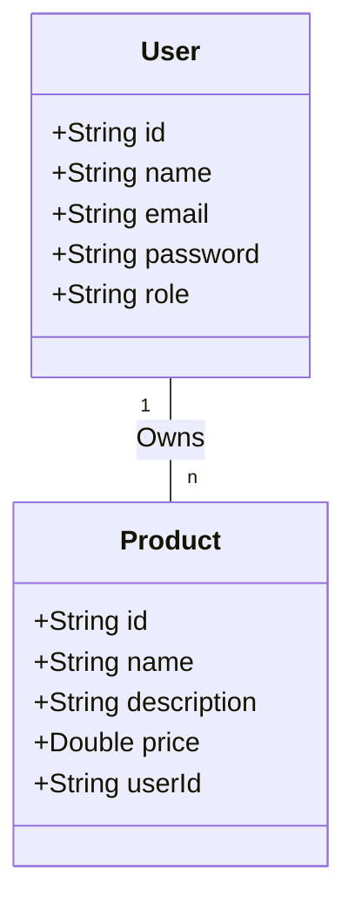

## Let's Play

### Objectives

You will be developing a basic CRUD (Create, Read, Update, Delete) API using Spring Boot with MongoDB, and it should adhere to RESTful principles. The application will contain user management and product management functionalities.

### Set Up

* Open IntelliJ IDEA
* Run LetsPlayApplication
* Open Postman

Database is now stored on: https://cloud.mongodb.com/ - Sign Up, login and browse collections.

### Project Details

#### 1. Database Design

#### 2. API Endpoints

* Authentication : https://localhost:2222/users/login
* Get all users: https://localhost:2222/users/all
* Get all users by admin: https://localhost:2222/usersByAdmin/all
* Get 1 user: https://localhost:2222/users/{id}
* Create a new user: https://localhost:2222/users/create
* Update a user: https://localhost:2222/users/{id}
* Delete a user: https://localhost:2222/users/delete/{id}
----------
* Get all products: https://localhost:2222/products
* Get 1 product: https://localhost:2222/products/get/{id}
* Create a product: https://localhost:2222/products/create
* Update a product: https://localhost:2222/products/update/{id}
* Delete a product: https://localhost:2222/products/delete/{id}

#### 3. Authentication & Authorization

* Authentication: Everyone
* Get all users: ROLE_USER, ROLE_ADMIN
* Get all users by admin: ROLE_ADMIN
* Get 1 user: ROLE_ADMIN
* Create a new user: Everyone
* Update a user: ROLE_ADMIN
* Delete a user: ROLE_ADMIN
---------
* Get all products: Everyone
* Get 1 product: Everyone
* Create a product: ROLE_USER, ROLE_ADMIN
* Update a product: ROLE_USER, ROLE_ADMIN
* Delete a product: ROLE_ADMIN

#### 4. Error Handling

The API should not return any 5XX errors. You should handle any possible exceptions and return appropriate HTTP response codes and messages.

#### 5. Security Measures

Implement the following security measures:

- Hash and salt passwords before storing them in the database.
- Validate inputs to prevent MongoDB injection attacks.
- Protect sensitive user information. Don't return passwords or other sensitive information in your API responses.
- Use HTTPS to protect data in transit.